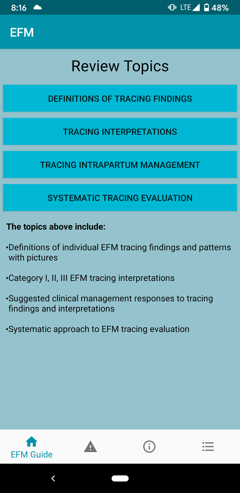

#### EFM GUIDE

The application mainly provides information about the basic EFM guidelines for the ease of Doctors. It was built by the requirements provided by Dr. Steinberg.We are 
a team of two who worked in designig the Application.
Team members: Akash Dilliwal, Varun Katragadda.

### Prerequisites

* ANDROID STUDIO(version 3.0 or above).
* Enable virtual view through bios if it is not enabled.

## BUILD

* Several Java Classes were used to  build for the creaton of the EFM guide.
* Different Fragments and containers were used to design all the individual buttons as a cluster.
* Different layout sheets were used for the styling of individual activites.
* All the text content is displayed by integrating the html files and parsing them according to the requirements.
* the images which provide the information can be zoomed in and out for precise information.

 

###  coding style 

 The coding is done in java for main files and in xml for styles implementations.

